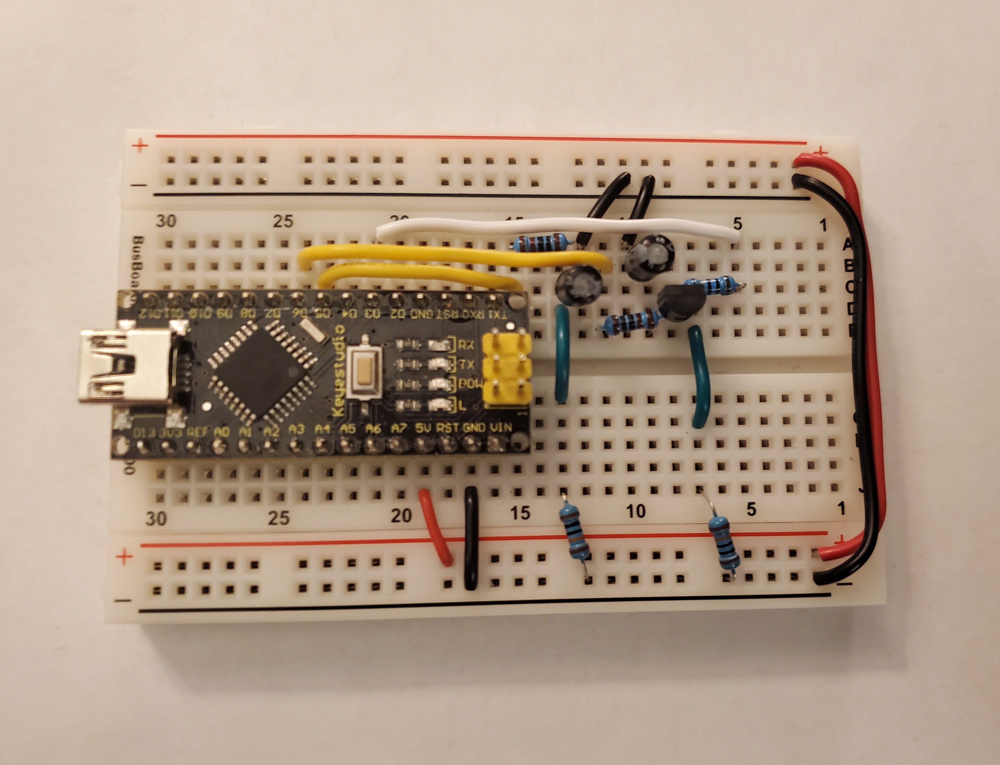
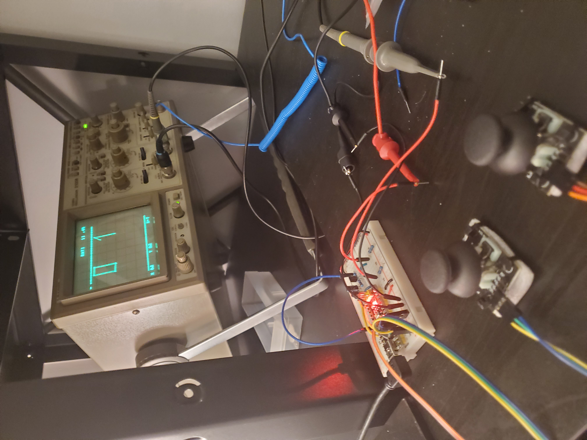

# Arduino CRT Driver

> Hacking an Arduino to control an oscilloscope like a CRT (to play Pong)
- [SETUP](#SETUP)
- [ABOUT](#ABOUT)
- [FUTURE IDEAS](#FUTURE-IDEAS)


# SETUP
Create the DAC circuit as shown in the schematic below and hook it up to the D5 and D6 pins of the Arduino (you must use these pins for DAC), D3 must also be used for the alpha pin. 



<br clear="left"/>
<br clear="left"/>

Hook the Joysticks up directly to pin A0 and A1 directly, The final result should look like this mess:


<br clear="left"/>
<br clear="left"/>

To flash and run the project on Linux, use:
``` 
./run.sh
```
This will also get cat serial output of the Arduino to terminal for debugging, hit ctrl-c to close it. 

# ABOUT
This project demonstrates an inexpensive DAC implementation utilizing Arduino's PWM output, you can modify the frequency of Arduino's PWM for specific pins (see `setup()` in `arduino-crt-driver.ino`), allowing for a stable analog voltage to be output with just resistors and capacitors. 

From here, using some math, we tune the PWM driving to the characteristic time of the DAC to move the capacitor voltage at a constant speed from voltage A to voltage B (see `1-beam-moving.ino`). In addition, by over/under-shooting voltage B, its possible to move the beam much faster and more accurately.

The general equation for the voltage of the DAC capacitor over time from an initial voltage of $V_i$ and a PWM voltage of $V_{PWM}$ is given by:

$$ V(t) = {(V_i - V_{PWM}) e^{-t/\tau} + V_{PWM}} $$

Where:

$$ \tau={{R_1 R_2} \over {R_1+R_2}} C $$

And $R_1$ is the 1K resistor between the PWM signal and the capacitor, and $R_2$ is the 100K pull down resistor which leads to ground. 

From here we can derive everything we need to know, such as how to move the beam with a desired speed (hint: take the derivative with respect to t, and assume everything is constant). 

To make calculations faster on the Arduino, measure time in factors of tau and voltage in Arduino pin setting (0-255), for an example see `_smoothMoveBeam(x,y,t)` in `1-beam-moving.ino` which uses internal time units of tau/sample_speed to drastically simplify the calculations.

# FUTURE IDEAS
Using this same system, it should be possible to drive a speaker and make a very basic digital synthesizer or decode audio from a generic file format and play it.

This project could also be used as a basic function generator for other projects.
